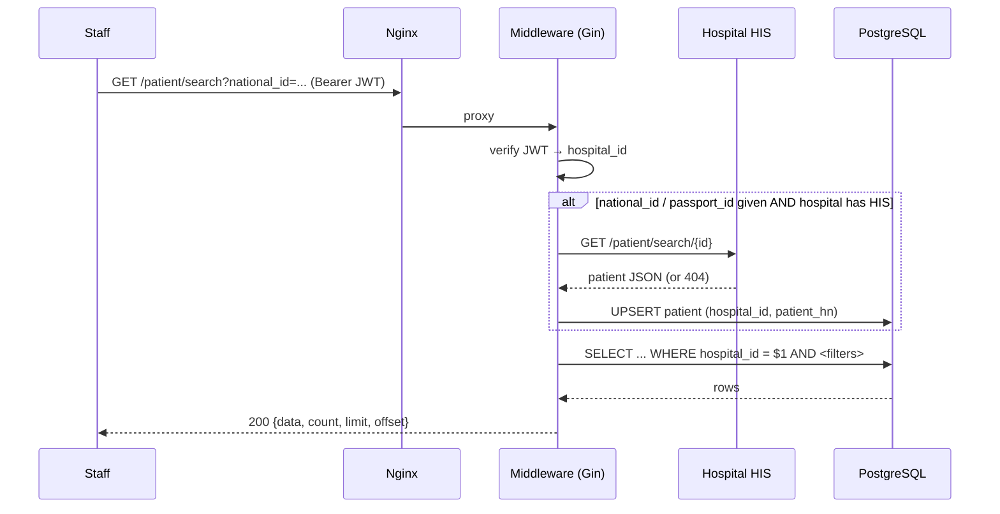
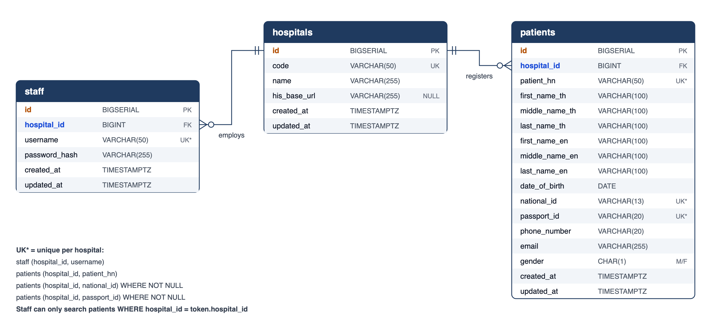
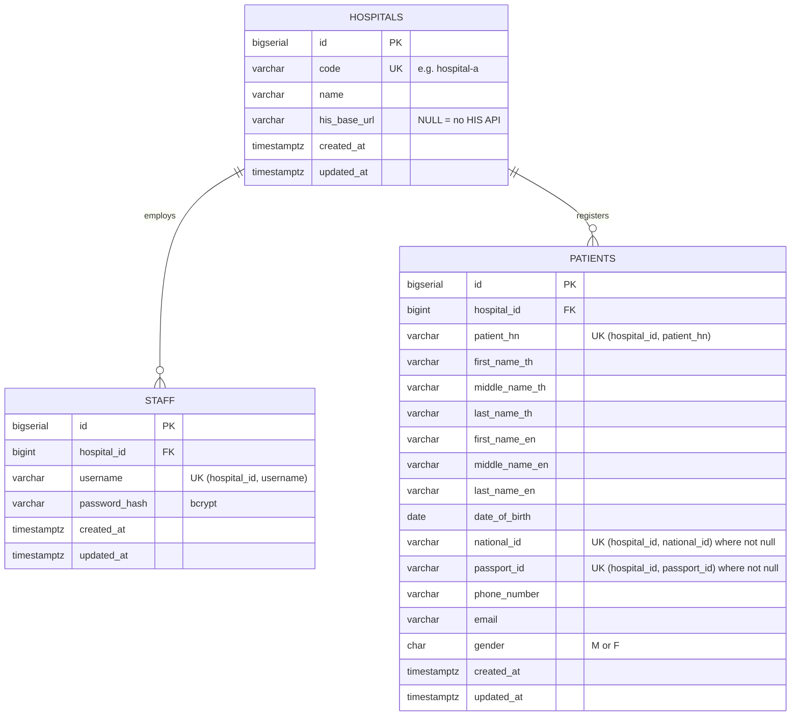

# Hospital Middleware — Development Planning

**Stack:** Go 1.24 · Gin · PostgreSQL 16 · Nginx · Docker Compose

## 1. Overview

Hospital Middleware sits between hospital staff and each hospital's HIS (Hospital Information System). Staff sign up and log in against their own hospital, then search patients. The middleware:

- keeps a local `patients` table in the same shape as the HIS response,
- refreshes a patient from the hospital's HIS (`GET {his_base_url}/patient/search/{id}`) whenever a search includes a `national_id` or `passport_id`,
- always limits search results to the logged-in staff member's hospital. The hospital comes from the signed JWT, never from the request.

```
Client ──HTTP──▶ Nginx :80 ──▶ Go/Gin app :8080 ──▶ PostgreSQL
                                     │
                                     └──HTTP──▶ Hospital HIS API (e.g. hospital-a.api.co.th)
```

### Search flow



If the HIS is down or slow (5 s timeout), the error is logged and the search falls back to the data already stored. A hospital without an HIS (`his_base_url IS NULL`) is served from the local database only.

## 2. Project Structure

```
.
├── cmd/
│   ├── server/main.go          # API entry point: config → DB → migrate → wire → serve (graceful shutdown)
│   └── mockhis/main.go         # Mock of Hospital A's HIS API for local/docker demo
├── internal/
│   ├── config/                 # Env-based configuration + validation
│   ├── database/               # pgx pool with start-up retry, embedded SQL migration runner
│   ├── models/                 # Domain types (Hospital, Staff, Patient, Date, search filter)
│   ├── repository/             # Postgres data access behind interfaces; dynamic, parameterised search query
│   ├── his/                    # HTTP client for HIS APIs + HIS→model mapping
│   ├── auth/                   # JWT (HS256) token manager, bcrypt password hasher
│   ├── service/                # Business logic: staff sign-up/login, patient search + HIS sync
│   ├── middleware/             # Bearer-token auth middleware
│   ├── handler/                # Gin handlers, request validation, error responses
│   └── router/                 # Route table, /health
├── migrations/                 # 0001_init.sql (schema), 0002_seed.sql (demo hospitals/patients), embedded
├── nginx/nginx.conf            # Reverse proxy, login rate limit, security headers
├── docs/                       # This document, ER diagram
├── Dockerfile                  # Multi-stage build → small non-root Alpine image (server + mockhis)
├── docker-compose.yml          # nginx + app + postgres + mock-his-a
├── Makefile                    # test, test-integration, up/down, cover
└── .env.example
```

**Layering:** `handler → service → repository / his`. Each layer depends on interfaces from the layer below, so each one is unit tested with fakes:

| Layer | What is tested |
|---|---|
| handler | HTTP status codes, validation messages, error mapping, hospital taken from token, GET + POST binding |
| service | Staff creation/login rules, HIS sync (hit, miss, error, no HIS, upsert failure), fallback |
| repository | SQL builder (unit) + real Postgres (integration: scoping, Thai/English names, upsert, uniqueness) |
| his | Real HTTP against `httptest` server: 200/404/500, bad JSON, timeout, URL escaping, mapping |
| auth / middleware | Token round-trip, expiry, wrong secret, alg confusion, missing claims, header parsing |

## 3. API Specification

Base URL (docker compose): `http://localhost:8080`. All bodies are JSON. Errors share one shape:

```json
{ "error": { "code": "VALIDATION_ERROR", "message": "request is invalid", "fields": { "password": "must be at least 8 characters" } } }
```

| Code | HTTP | When |
|---|---|---|
| `VALIDATION_ERROR` | 400 | Missing/invalid fields, malformed JSON |
| `UNAUTHORIZED` | 401 | Missing, malformed, invalid or expired token |
| `INVALID_CREDENTIALS` | 401 | Wrong username/password/hospital on login |
| `HOSPITAL_NOT_FOUND` | 404 | Unknown hospital on staff creation |
| `USERNAME_TAKEN` | 409 | Username already exists in that hospital |
| `INTERNAL_ERROR` | 500 | Unexpected error (details are logged, never returned) |
| — | 429 | Nginx login rate limit exceeded (5 req/s per IP, burst 10) |

### 3.1 `POST /staff/create`

Creates a staff member of a hospital. Usernames are unique **per hospital**.

Request:

| Field | Type | Rules |
|---|---|---|
| `username` | string | required, 3–50 chars |
| `password` | string | required, 8–72 chars (stored as bcrypt hash) |
| `hospital` | string | required, hospital code, e.g. `hospital-a` (case-insensitive) |

```json
{ "username": "nurse01", "password": "password123", "hospital": "hospital-a" }
```

`201 Created`:

```json
{
  "id": 1,
  "username": "nurse01",
  "hospital": { "id": 1, "code": "hospital-a", "name": "Hospital A" },
  "created_at": "2026-09-28T16:29:51.470021+07:00"
}
```

Errors: `400 VALIDATION_ERROR`, `404 HOSPITAL_NOT_FOUND`, `409 USERNAME_TAKEN`.

### 3.2 `POST /staff/login`

Request: `username`, `password`, `hospital` (all required).

`200 OK`:

```json
{
  "access_token": "eyJhbGciOiJIUzI1NiIs...",
  "token_type": "Bearer",
  "expires_at": "2026-09-29T16:29:51.768305+07:00",
  "staff": { "id": 1, "username": "nurse01", "hospital": { "id": 1, "code": "hospital-a", "name": "Hospital A" }, "created_at": "..." }
}
```

JWT claims: `staff_id`, `username`, `hospital_id`, `hospital_code`, `iss`, `sub`, `iat`, `exp` (default TTL 24 h).

Errors: `400 VALIDATION_ERROR`, `401 INVALID_CREDENTIALS`. Unknown hospital, unknown user and wrong password all return the same error, so a caller can't tell which one was wrong.

### 3.3 `GET /patient/search` (also `POST` with a JSON body)

Requires `Authorization: Bearer <access_token>`. All inputs are optional; given filters are combined with AND. Results are **always** limited to the caller's hospital.

| Param | Match |
|---|---|
| `national_id` | exact (also triggers HIS lookup) |
| `passport_id` | exact (also triggers HIS lookup) |
| `first_name` | case-insensitive partial, Thai **or** English |
| `middle_name` | case-insensitive partial, Thai **or** English |
| `last_name` | case-insensitive partial, Thai **or** English |
| `date_of_birth` | exact, `YYYY-MM-DD` |
| `phone_number` | exact |
| `email` | case-insensitive exact, must be a valid email |
| `limit` | 1–100, default 20 |
| `offset` | ≥ 0, default 0 |

```
GET /patient/search?first_name=som&date_of_birth=1985-04-12
Authorization: Bearer eyJhbGciOi...
```

`200 OK`:

```json
{
  "data": [
    {
      "id": 1, "hospital_id": 1, "patient_hn": "HN-A-0001",
      "first_name_th": "สมชาย", "middle_name_th": null, "last_name_th": "ใจดี",
      "first_name_en": "Somchai", "middle_name_en": null, "last_name_en": "Jaidee",
      "date_of_birth": "1985-04-12", "national_id": "1103700000011", "passport_id": null,
      "phone_number": "0811111111", "email": "somchai@example.com", "gender": "M",
      "created_at": "...", "updated_at": "..."
    }
  ],
  "count": 1, "limit": 20, "offset": 0
}
```

Errors: `400 VALIDATION_ERROR`, `401 UNAUTHORIZED`.

### 3.4 `GET /health`

`200 {"status":"ok"}` when the database is reachable, otherwise `503 {"status":"unhealthy"}`. Used by the docker compose health check.

### 3.5 External: Hospital HIS API (consumed)

`GET {his_base_url}/patient/search/{id}`, where `id` is a national ID or passport ID. `200` returns the patient fields listed in the assignment; `404` means not found. Blank strings from the HIS are stored as `NULL`. An invalid `date_of_birth` or `gender` is dropped instead of rejecting the whole record.

## 4. ER Diagram





### Design decisions

- **Patient belongs to a hospital.** The same person at two hospitals is two rows with two HNs, the same way HIS systems work. Scoping is a plain `WHERE hospital_id = $1`, so cross-hospital leaks can't happen.
- **Staff username is unique per hospital** (`UNIQUE (hospital_id, username)`), because login takes `hospital` as input.
- **Optional fields are nullable.** A foreign patient may have no Thai name or national ID. Partial unique indexes stop two HNs in the same hospital from sharing a national ID or passport.
- **Indexes** on `(hospital_id, date_of_birth)`, `(hospital_id, phone_number)` and `(hospital_id, LOWER(email))` for the exact-match filters. Name search uses `ILIKE '%…%'`; at scale this would move to `pg_trgm` GIN indexes.
- **Migrations are embedded** in the binary and applied on start-up, tracked in `schema_migrations`.

## 5. Security notes

- Passwords are bcrypt hashes. Password length is capped at 72 bytes, bcrypt's limit.
- JWT is HS256 only (other algorithms are rejected), signed with a secret of at least 32 characters, and requires `exp`.
- The hospital scope comes only from the signed token. A `hospital_id` in the query string is ignored.
- Every query is parameterised. `LIKE` wildcards in user input are escaped.
- Nginx rate-limits `/staff/login`, hides its version and adds basic security headers. The app trusts `X-Forwarded-For` only from private networks.
- `/staff/create` is open, as the assignment specifies. In production it would require an admin role or an invitation flow.

## 6. Running & testing

```bash
cp .env.example .env              # set JWT_SECRET (openssl rand -hex 32)
docker compose up -d --build      # nginx on http://localhost:8080
make test                         # unit tests
make test-integration             # + repository tests against a throwaway Postgres container
```
